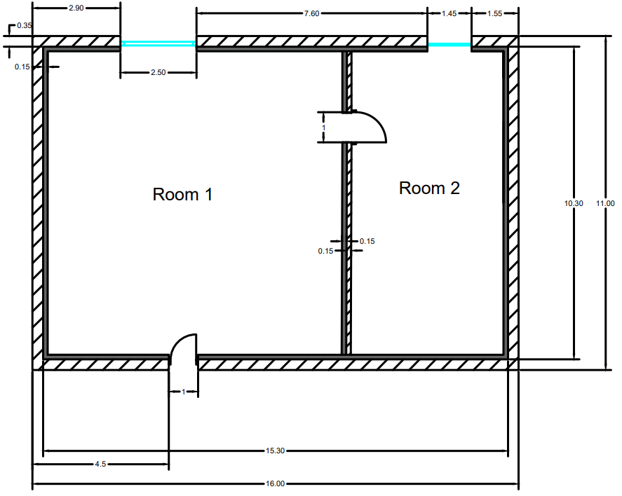

-------------------------------------------------------------------------------------------------------------------------------------------------------------------------
Dynamic Models for Building Energy Management
-------------------------------------------------------------------------------------------------------------------------------------------------------------------------
Group members: 
1. Tannous Maroun
2. Bell Emily
3. Bicudo Bregion Beatriz
4. Abdelkarim Aya
-------------------------------------------------------------------------------------------------------------------------------------------------------------------------
MODEL
-------------------------------------------------------------------------------------------------------------------------------------------------------------------------
Apartment sizing
-------------------------------------------------------------------------------------------------------------------------------------------------------------------------
The apartment analyzed is in the following figure and contains 2 rooms, which are linked by a door. Each room contains a window and room 1 also contains a door.\
\
*Figure 1. Apartment analyzed*

-------------------------------------------------------------------------------------------------------------------------------------------------------------------------
Boundary conditions
-------------------------------------------------------------------------------------------------------------------------------------------------------------------------
- The thermal capacity of the windows, the convective heat transfer through the windows, as well as any radiant heat exchange between the walls themselves and between the windows and the walls were neglected
- The door between the toilet and the office room is open 
- The windows and the entrance’ door were closed during the simulation so the door is considered to be part of the wall, but the window is still taken separately
- It is assumed the sun is to the upper left hand corner of the floorplan, and so the sun is incident only on the upper and left hand walls
- This apartment is thermally isolated so there is no heat transfer through the floor or ceiling
- The indoor air’s temperature is homogenous
- The heat transfer is linear

-------------------------------------------------------------------------------------------------------------------------------------------------------------------------
Choosing of materials
-------------------------------------------------------------------------------------------------------------------------------------------------------------------------
- Window\
 *Figure 2. Window material*
- External wall\
*Figure 3. External wall material*
- Internal wall\
*Figure 4. Internal wall material*

-------------------------------------------------------------------------------------------------------------------------------------------------------------------------
Thermal model
-------------------------------------------------------------------------------------------------------------------------------------------------------------------------

-------------------------------------------------------------------------------------------------------------------------------------------------------------------------
Calculation of conductances and capacities

| Material | Thickness(mm)   | Density (kg/m³) | Thermal conductivity (W/mK) | Specific heat(J/kgC) | Convection coefficient (W/m²K) |
| ----- | ----- | ----- | ----- | ----- | ----- |
| Glass | 4 | 2500 | 1.05 | 840 | 15 |
| Air (20 C) | 12 | 1.204 | 0.025 | 1000 | 50 |
| Concrete (external) | 350 | 2300 | 1.4 | 880 | 10 |
| Concrete (internal) | 150 | 2300 | 1.4 | 880 | 10 |
| Mineral fibre insulation | 150 | 20 | 0.035 | 1030 | 20 |
| Wood (oak) | 40 | 750 |0.17 | 2380 | 10 |

From these values, the thermal conductances and capacities can be calculated.

|Quantity |Equation|
| ----- | ----- | 
|Thermal conductance, conduction| Gcond = 1/Rcond =(lambda*S)/w|
|hermal conductance, convection|conv=1/Rconv=hS|
|thermal conductance, radiation|Grad=1/Rrad=hS where hr=sigma x epsilon (Ts-Te)(Ts^2+T2^2)|
|Thermal conductance, advection| Gadv=rho*c*dv/dt|
|Thermal capacity |C=rho*c*w*S|

-------------------------------------------------------------------------------------------------------------------------------------------------------------------------
Matrices and inputs for the DAE model
-------------------------------------------------------------------------------------------------------------------------------------------------------------------------
Due to the number of nodes and branches, it was not feasible to manually write all the matrices, so instead a description of the structure of each matrix is given below.

The incidence matrix, A, is a matrix that describes the topology of the network. It has dimensions m x n, where m is the number of branches (conductances) in the network and n is the number of nodes (unknown temperatures). The elements of the matrix are given by:

- A_ij = -1, if edge j leaves node i
- A_ij = 1, if edge j enters node i
- A_ij = 0, otherwise\

The conductance matrix, G, is a diagonal matrix of size m x m (no. conductances square matrix), with the values on the diagonal being the sum of the conductances in that branch.

The capacity matrix, C, is a diagonal matrix of size n x n where the values are the capacities as calculated using the previously stated equation.
The temperature source input is vector b, of length m, containing all the known temperatures.

Vector f is a vector of length n containing all the known flow rates at each node.

The following equations will then be used to solve the model:

